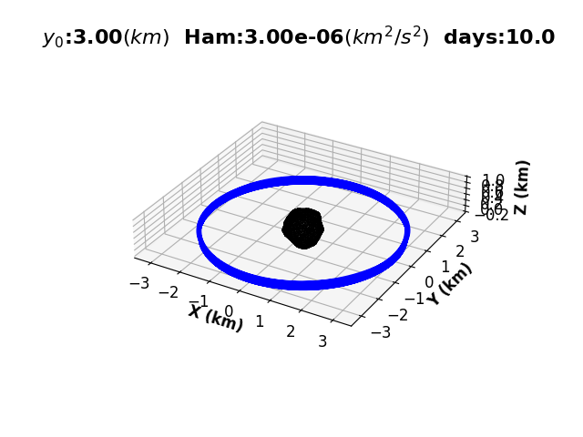

# Negri-Prado-Control-Law

For application to Mass Concentration (MASCON) models for asteroids, and mission design, the control law developed by Rodolfo Batista Negri and Antônio F. B. A. Prado was utilized to estimate the required $\Delta V$ for stabilizing an escape trajectory. This has a wide range of application in space mission design, and can be adjusted to allow for various configurations. Follow the link for more information: [Detailed Report](Control_Law_Report.pdf)

# Controlling an Escape Trajectory:

This is an example of an otherwise escape trajectory being stabilized. This utilized a total of $\Delta V \approx 8.15897~m/s$ to stabilize the controlled trajectory for a total of 10 days:

# Configuration for a full asteroid scan:
This configuration utilized a total of $\Delta V \approx 7.55313~m/s$ over the course of 4 days, and lead to a trajectory that covered the asteroids surface. This can be utilized to create a detailed scan over an asteroid in a relatively short time span:

### Running Simulations  
The main simulation codes to run are:

1) `Main_Sim.py`
2) `Main_Sim_No_Compare.py` 
3) `Negri_Prado_CTRL.py` 

### Sources:  
- https://doi.org/10.2514/1.G005863
- https://www.researchgate.net/publication/356221759_FIRST_APPROXIMATION_FOR_SPACECRAFT_MOTION_RELATIVE_TO_99942_APOPHIS
