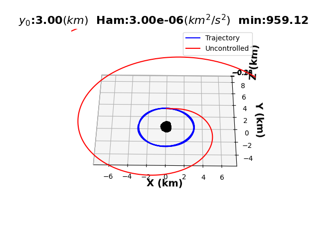
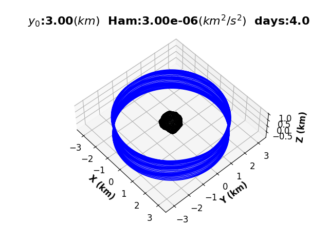

# Negri-Prado-Control-Law

For application to Mass Concetration (MASCON) models for asteroids, and mission design, the control law developed by Rodolfo Batista Negri and Antônio F. B. A. Prado was utilized to estimate the required $\Delta V$ for stabalizing an escape trajectory. This has a wide range of application in space mission design, and can be adjusted to allow for various configurations. Follow the link for more information: [Detailed Report](Control_Law_Report.pdf)

# Controlling an Escape Trajectory:

# Confiuration for a full asteroid scan:

### Running Simualtions 
The main simaltuion codes to run are:

1) `Main_Simpy`
2) `Main_Sim_No_Compare.py` 
3) `Negri_Prado_CTRL.py` 

### Souces: 
https://doi.org/10.2514/1.G005863
https://www.researchgate.net/publication/356221759_FIRST_APPROXIMATION_FOR_SPACECRAFT_MOTION_RELATIVE_TO_99942_APOPHIS
